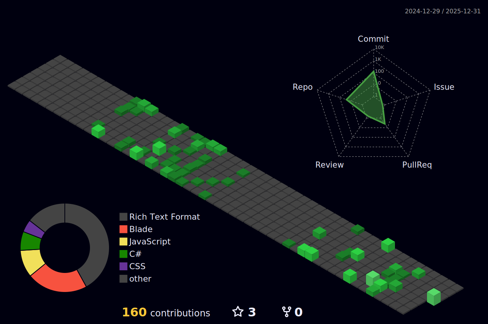

# Olá, eu sou o Pablo! 👋

Sou estudante de **Tecnologia em Sistemas para Internet no SENAC** e atuo como Analista de Suporte e Desenvolvedor. Atualmente estou focado em aprofundar meus conhecimentos em ecossistemas Web e Enterprise.

- 🔭 Atualmente trabalhando em projetos acadêmicos com **Laravel** e estudando sozinho sobre **.NET**.
- 🌱 Estudando para certificações em **C#** e arquitetura de software.
- 💼 Experiência com **SQL Server** e suporte técnico.

---

### 🛠️ Tech Stack

  
  
  
  

---

### 📊 Visão Geral

---

### 🏆 Contribuições em 3D

  

